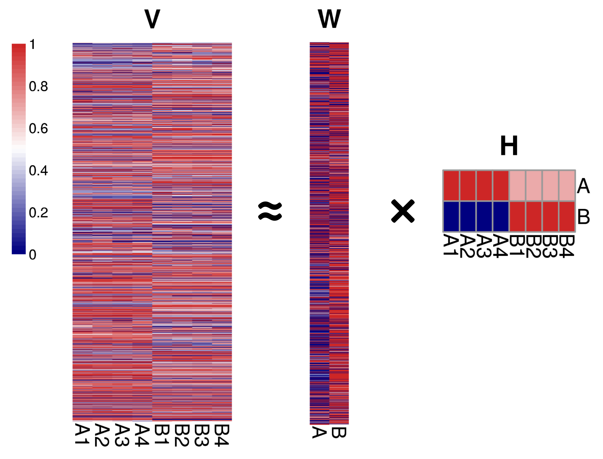

# Discriminant Non-Negative Matrix Factorization

 

Discriminant Non-Negative Matrix Factorization is to extend the Non-negative Matrix Factorization algorithm in order to extract features that enforce not only the spatial locality, but also the separability between classes in a discriminant manner. Two kinds of Discriminant Non-Negative Matrix Factorization were implemented so far.

Installation:

	devtools::install_github("zhilongjia/DNMF")

Citation:

Jia Z, Zhang X, Guan N, Bo X, Barnes MR, Luo Z (2015) [Gene Ranking of RNA-Seq Data via Discriminant Non-Negative Matrix Factorization](https://journals.plos.org/plosone/article?id=10.1371/journal.pone.0137782). PLoS ONE 10(9): e0137782. doi:10.1371/journal.pone.0137782

Reference: 
+ Zafeiriou, Stefanos, et al. [*Exploiting discriminant information in nonnegative matrix factorization with application to frontal face verification.*](https://pubmed.ncbi.nlm.nih.gov/16722172/) Neural Networks, IEEE Transactions on 17.3 (2006): 683-695.
+ Kim, Bo-Kyeong, and Soo-Young Lee. [*Spectral Feature Extraction Using dNMF for Emotion Recognition in Vowel Sounds.*](https://link.springer.com/chapter/10.1007/978-3-642-42051-1_59) Neural Information Processing. Springer Berlin Heidelberg, 2013.
+ Lee, Soo-Young, Hyun-Ah Song, and Shun-ichi Amari. [*A new discriminant NMF algorithm and its application to the extraction of subtle emotional differences in speech.*](https://link.springer.com/article/10.1007/s11571-012-9213-1#page-1) Cognitive neurodynamics 6.6 (2012): 525-535.

